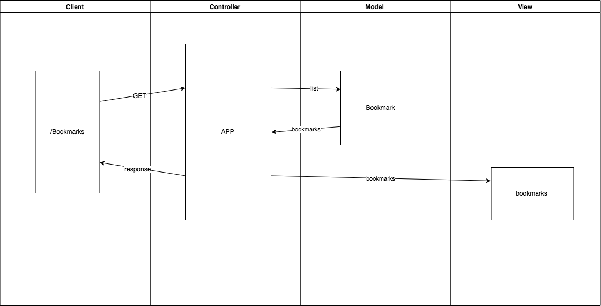

# Bookmark manager Challenge

For the 6th week we will build a web application with a database integrated to store the bookmarks a user wants.

## Challenge 01: Creating User stories

In this challenge we will write our user stories from the specifications required:

- Show a list of bookmarks :white_check_mark:
- Add new bookmarks
- Delete bookmarks
- Update bookmarks
- Comment on bookmarks
- Tag bookmarks into categories
- Filter bookmarks by tag
- Users are restricted to manage only their own bookmarks

We will focus in the first requirement,

>As a user,
So that can remember my favourites web pages,
I'd like see a list of my bookmarks.

With this user story we will draw a rough Domain model. (taken from walkthrough)



## Challenge 04: Setting up a database

>As a user,
So that I can save my favourite website,
I would like to add the site's address and title to bookmark manager.

## challenge 05: Creating Your First Table
The database used is made with PostgreSQL:
To create the database we use:
```psql
CREATE DATABASE "bookmark_manager";
\c bookmark_manager;
```
To create the needed table we run the SQL scripts from /db/migrations in the provided order.

### To run the Bookmark Manager app:

```shell
rackup -p 8181
```
To view bookmarks, navigate to `localhost:8181/bookmarks`.


con.exec( "SELECT * FROM bookmarks" ) do |result|
  puts "     PID | Url             |"
  result.each do |row|
    puts " %7d | %-16s | %s " %
      row.values_at('id', 'url')
  end
end

con.exec( "SELECT * FROM bookmarks" ) do |result|
  result.each do |row|
    p row.values_at('id')
  end
end
